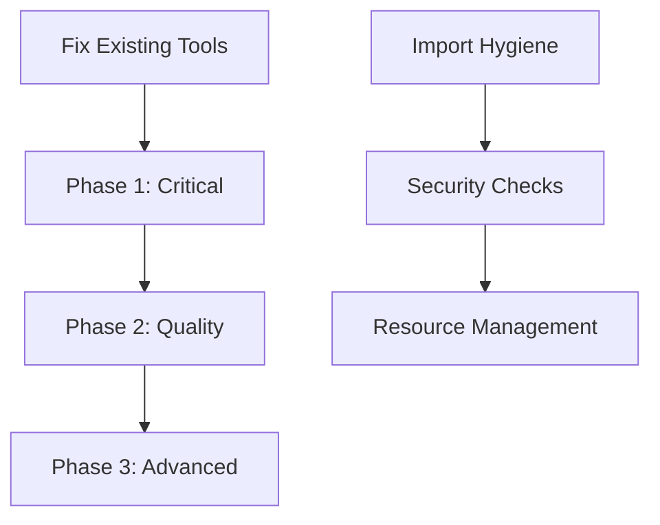

# DinoScan Development Roadmap 🦖

> **Vision**: A swiss-army lint-osaur that provides comprehensive static analysis for Python projects with advanced duplicate det### 2.5 Documentation & Comment Quality

**Priority**: 🟢 **Low**

- **Docstring validation**: Parameter/return type mismatches with actual code
- **TODO/FIXME tracking**: Age-based reporting of stale comments
- **API documentation**: Missing docstrings for public functions

---

## 🚀 Phase 3: Advanced Features (Future Enhancement)

> **Goal**: Implement sophisticated analysis and intelligence features

### 3.1 Enhanced Duplicate Detection

**Priority**: 🟢 **Future**

- **Near-duplicate analysis**: Winnowing fingerprints for small-edit detection
- **Copy-paste clusters**: N-way duplication across modules
- **Refactoring suggestions**: Automated helper function extraction recommendations

### 3.2 Security & PII Detection

**Priority**: 🟡 **Medium**

- **Advanced secret detection**: AWS keys, JWTs, high-entropy strings
- **PII pattern matching**: Email/phone/SSN in data files (configurable allowlists)
- **Git hygiene validation**: Secret patterns missing from .gitignore

### 3.3 DinoAir-Specific Features 🦖

**Priority**: 🟢 **Future**

- **Import time budget**: Static estimation of module import costs
- **Cold-start hotspot analysis**: Heavy modules imported by many others
- **Repository health scoring**: DinoQA score badge (0-100)

---

## ⚙️ Implementation Strategy

### Phase Prioritization



### Development Order (Maximum Signal per Hour)

1. **🔧 Fix Current Issues** _(Immediate)_
   - Repair dead-code-detector.ps1 PowerShell syntax
   - Fix style-lint-analyzer.ps1 regex patterns

2. **📦 Import Hygiene Pack** _(Week 1)_
   - Unused imports detection
   - Type-only import validation
   - Side-effect import analysis

3. **🏗️ Layering Rules** _(Week 2)_
   - Forbidden dependency enforcement
   - Architecture validation (uses existing graph!)

4. **🔒 Security Footguns** _(Week 3)_
   - YAML/pickle/subprocess/requests vulnerability detection

5. **💾 Resource Lifetime** _(Week 4)_
   - File/socket leak detection
   - Async pitfall identification

6. **🔍 Near-Duplicate Clusters** _(Week 5)_
   - Enhanced duplicate detection with clustering

---

## 🏗️ Technical Architecture

### Core Engine Design

```python
# Conceptual Architecture
class DinoScanEngine:
    """Parse once → module graph + AST index"""

    def __init__(self):
        self.module_graph = ModuleGraph()
        self.ast_index = ASTIndex()  # symbols, imports, side-effects
        self.rule_packs = []

    def analyze(self, project_path: str) -> AnalysisResult:
        # Single-pass parsing and indexing
        modules = self.parse_project(project_path)

        # Build comprehensive index
        self.ast_index.build(modules)
        self.module_graph.build_dependencies(modules)

        # Run all rule packs
        issues = []
        for pack in self.rule_packs:
            issues.extend(pack.check(self.ast_index, self.module_graph))

        return AnalysisResult(issues)
```

### Rule Pack Architecture

```python
class RulePack:
    """Base class for analysis rule groups"""

    def __init__(self, config: Dict[str, Any]):
        self.config = config
        self.rules = self.load_rules()

    def check(self, ast_index: ASTIndex, graph: ModuleGraph) -> List[Issue]:
        """Each check is a small visitor with id, message, severity, autofix"""
        pass

class ImportHygieneRules(RulePack):
    """Import-related checks"""
    pass

class SecurityRules(RulePack):
    """Security vulnerability detection"""
    pass
```

---

## 📋 Configuration & Integration

### Configuration File: `dinoscan.toml`

```toml
[dinoscan]
version = "1.0"

[rules]
# Enable/disable rule categories
import-hygiene = true
security = true
performance = true
testing = false

[severity]
# Configure severity levels per rule type
unused-imports = "warning"
security-vulnerabilities = "error"
performance-smells = "warning"

[layering]
# Architecture enforcement rules
forbidden = [
    "ui -> database",
    "domain -> ui",
    "utils -> business"
]

[performance]
# Enable framework-specific rules only if dependencies exist
pandas-rules = "auto"  # Enable if pandas in requirements
numpy-rules = "auto"   # Enable if numpy in requirements

[exclude]
# Paths to exclude from analysis
paths = [
    "tests/fixtures/**",
    "migrations/**",
    "build/**"
]
```

### Output Formats

- **Console**: Pretty formatted with colors and severity indicators
- **JSON**: Structured data for programmatic consumption
- **SARIF**: GitHub Code Scanning compatible format
- **GitHub Annotations**: Direct integration with PR workflows

### CI/CD Integration

```yaml
# GitHub Actions integration
- name: DinoScan Analysis
  run: |
    python -m dinoscan --config dinoscan.toml --output sarif
    # Upload results to GitHub Code Scanning
```

### Pre-commit Hook

```bash
# Fast path: analyze only changed files
dinoscan --changed-only --fail-on=error

# Full analysis in CI
dinoscan --full --output=github-annotations
```

### Auto-fix Capabilities

Safe automatic fixes where possible:

- Import reordering and cleanup
- Adding context managers (`with open(...)`)
- Inserting missing `timeout=` parameters
- Converting `datetime.now()` to timezone-aware calls

---

## 📈 Success Metrics

- **Build Break Prevention**: Catch critical issues before they reach main branch
- **Code Quality Improvement**: Measurable reduction in technical debt
- **Security Posture**: Zero critical security vulnerabilities in production
- **Developer Velocity**: Faster code reviews with automated quality checks
- **Repository Health**: Maintain DinoQA score above 90/100import analysis, and intelligent code quality checks.

## 📋 Table of Contents

1. [Current Status](#current-status)
2. [Phase 1: Critical Build Breakers](#phase-1-critical-build-breakers-high-priority)
3. [Phase 2: Code Quality & Polish](#phase-2-code-quality--polish-medium-priority)
4. [Phase 3: Advanced Features](#phase-3-advanced-features-future-enhancement)
5. [Implementation Strategy](#implementation-strategy)
6. [Technical Architecture](#technical-architecture)
7. [Configuration & Integration](#configuration--integration)

---

## 🚨 Current Status

### ✅ **Working Tools**

- **Security Analyzer** - Comprehensive vulnerability scanning
- **Duplicate Code Finder** - Function and code block analysis
- **Circular Import Finder** - Dependency cycle detection

### ❌ **Needs Fixing**

- **Dead Code Detector** - PowerShell syntax errors
- **Style-Lint Analyzer** - Regex pattern issues

---

## 🎯 Phase 1: Critical Build Breakers (High Priority)

> **Goal**: Implement checks that catch serious issues that should break the build

### 1.1 Import Hygiene Enhancement

**Priority**: 🔴 **Critical**

- **Unused imports detection**: Flag imported modules/functions that are never used
- **Re-export validation**: Verify all names in `__all__` actually exist
- **Type-only imports**: Ensure `TYPE_CHECKING` imports are properly isolated
- **Side-effect imports**: Detect modules that perform I/O or mutate globals at import time
- **Relative import validation**: Flag dangerous `from ..` patterns that escape package boundaries

### 1.2 Architecture & Layering Rules

**Priority**: 🔴 **Critical**

- **Forbidden dependencies**: User-configurable rules (e.g., `ui -> domain -> infra`)
- **Acyclic layer enforcement**: Prevent "upstream" imports that violate architecture
- **Feature module isolation**: Block cross-feature imports except via public APIs

### 1.3 Security Vulnerability Detection

**Priority**: 🔴 **Critical**

- **Unsafe deserialization**: `pickle.load`, `yaml.load` without SafeLoader, `eval`/`exec`
- **Subprocess vulnerabilities**: `shell=True` with user input, missing `check=True`
- **HTTP security issues**: `verify=False`, missing timeouts, URL concatenation
- **SQL injection patterns**: f-string/concatenation in SQL queries
- **Path traversal risks**: User input in file paths without sanitization

### 1.4 Resource Management

**Priority**: 🟡 **High**

- **Resource leaks**: Files/sockets not using context managers
- **Async anti-patterns**: Blocking calls in async code, missing `await`
- **Thread safety**: Mutable globals without proper synchronization
- **Process cleanup**: Unjoined threads and processes

### 1.5 Package & Configuration Validation

**Priority**: 🟡 **High**

- **pyproject.toml coherence**: Validate name/version/entry points consistency
- **Dependency validation**: Check imports match declared dependencies
- **Namespace packages**: Validate PEP 420 compliance and structure

---

## 🎨 Phase 2: Code Quality & Polish (Medium Priority)

> **Goal**: Implement checks that improve code quality and maintainability

### 2.1 Performance Code Smells

**Priority**: 🟡 **Medium**

- **Quadratic patterns**: Nested loops with list membership checks (suggest sets)
- **String concatenation**: In loops (suggest str.join or list comprehension)
- **Pandas/NumPy inefficiencies**: Row-by-row operations, unnecessary copying
- **Hot-path logging**: Heavy string formatting without lazy evaluation

### 2.2 API & Exception Hygiene

**Priority**: 🟡 **Medium**

- **Exception handling**: Bare `except:`, overly broad exception catching
- **Error handling patterns**: `log+return None` in libraries (prefer raising)
- **Public API consistency**: Functions in `__all__` missing docstrings
- **Context preservation**: Re-raising exceptions without losing context

### 2.3 Time, Randomness & Locale Issues

**Priority**: 🟢 **Low**

- **Timezone awareness**: `datetime.now()` vs `datetime.now(tz=...)`
- **Secure randomness**: `random` module for security tokens (suggest `secrets`)
- **Locale dependencies**: Manual timezone math, locale-specific formatting

### 2.4 Test Quality & Reliability

**Priority**: 🟡 **Medium**

- **Flaky test patterns**: Sleeps, network calls without mocks
- **Fixture optimization**: Heavy function-scoped fixtures, autouse side effects
- **Coverage analysis**: Public functions with zero test references

Coverage blind spots: public functions with zero test references (static grep + symbol table).

Docs & comments integrity

Param/return drift: docstring params that don’t exist, missing raises in docstring vs code.

TODO rot: TODO/FIXME older than N days (stamp with date and surface in report).

Duplicates+: smarter near-duplicate detection

Winnowing fingerprints: catch near-dupes with small edits.

Copy-pasta clusters: detect N-way duplication across modules; suggest factoring helpers.

Secret & PII tripwires (lightweight)

Secrets heuristics: AWS keys, JWTs, generic high-entropy strings.

PII regexes: emails/phones/SSNs in sample data folders; configurable allowlists.

Git hygiene: files matching known secret patterns not present in .gitignore.

How to wire it cleanly

Core engine: Parse once → module graph + AST index (symbols, imports, side-effect signals).

Rule packs: Each check is a small visitor with: id, message, severity, autofix capability (if applicable).

Config: dinoqa.toml with:

include/exclude globs

layering rules

severities per rule (error/warn/ignore)

perf check toggles (enable pandas/numpy rules only if those deps exist)

Outputs: pretty console, JSON (SARIF for GitHub code scanning), GitHub annotations.

Pre-commit hook: fast path (changed files only); full run in CI.

Autofixes: where safe (e.g., import reordering, with open(...) as f:, insert timeout= in requests).

Fast implementation order (max signal per hour)

Import hygiene pack (unused/type-only/side-effects)

Layering rules + forbidden edges (uses your existing graph!)

Security footguns (yaml/pickle/subprocess/requests)

Resource lifetime + async pitfalls

Near-duplicate “cluster” mode

Extra spice for DinoPit 🦖

“Import time budget”: statically estimate “import cost” by counting top-level work (calls/loops); gate modules to a budget.

“Cold-start hotspots” report: list modules imported by many others + doing work at import—these often anchor cycle chains.

Repo health badge: tiny JSON → shields.io style “DinoQA: 94/100”.
